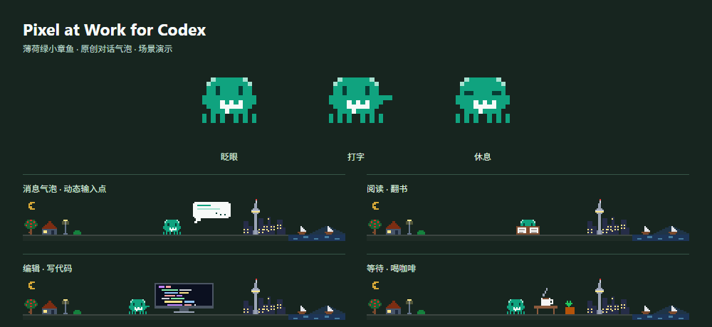

# Pixel at Work for Codex

A tiny mint pixel octopus that works above your Codex / ChatGPT desktop composer.

Windows x64 · transparent overlay · click-through · local session activity · MIT

这是一个 Windows 桌面悬浮伴侣：小章鱼会随 Codex 的阅读、编辑、查资料、运行工具等活动切换动画。薄荷绿角色、白色对话气泡和动态输入点让它更有聊天助手的感觉。保留原作的读书、打字、眨眼、走路、睡觉及节日装饰。

## 下载与启动

1. 到 [Releases](https://github.com/yzdashuaige111-eng/pixel-at-work-codex/releases/latest) 下载 Windows x64 压缩包。
2. 解压到一个可以写入文件的文件夹，双击“启动悬浮条.vbs”或 PixelAtWork.exe。
3. 打开 Codex / ChatGPT 桌面应用。悬浮条自动出现在输入框上方。

运行环境：Windows 10/11 x64、.NET Framework 4.8、Microsoft Edge WebView2 Runtime。只支持 Windows x64；macOS 与 Linux 尚未支持。压缩包包含 WebView2 SDK 的必要文件，浏览器运行时需已安装。

## 控制

| 操作 | 方法 |
| --- | --- |
| 显示 / 隐藏 | Ctrl+Alt+O，或双击托盘图标 |
| 微调位置 | Ctrl+Alt+方向键，每次 12 个逻辑像素 |
| 手动定位 | 鼠标放在输入框顶边中间，按 Ctrl+Alt+P |
| 恢复自动对齐 | 托盘 → 自动对齐输入框 |
| 暂停动画 | 托盘 → 减少动画 |
| 切换状态来源 | 托盘 → 绑定最近活动的 Codex 会话 |
| 退出 | 托盘 → 退出悬浮条 |

图案和透明区域都让鼠标点击穿透，不抢输入焦点。切换到其他应用或最小化主窗口时隐藏。位置通过 Windows 可访问性边界跟随输入框，支持分栏和输入框高度变化；无法识别时可以手动定位。

## 会话如何连接

首次启动自动生成本地 config.json。Codex 数据位置取环境变量 CODEX_HOME，未设置时使用用户目录下的 .codex。会话取 CODEX_THREAD_ID，未设置时选择最近更新的本地会话记录。

**位置跟随桌面窗口，活动跟随绑定的 Codex 会话。** 切换聊天不会自动重新绑定。多任务同时运行时，“最近活动”可能是后台任务；如需精确绑定，可编辑 config.json 中的 threadId 后重启。

配置示例见 config.example.json。codexHome 和 threadId 留空会在启动时自动检测；也可以分别填入自己的 Codex 数据目录和会话 ID。

工具状态来自 Codex 的本地会话记录。普通 ChatGPT 聊天不一定产生这些记录。记录格式及桌面控件结构并非稳定的公开插件接口，应用更新后可能需要适配。“正在处理”只表示任务尚未结束；合并工具调用按可见名称归类，无法保证每个子调用都有独立动画。

原作保留 41 种场景；已连接阅读、查找、编辑、网络查资料、构建、测试、下载、装依赖、Git、Python、运行工具、等待回答、完成和失败等活动。

## 本地数据

悬浮程序不上传会话内容，不修改宿主安装文件或 Codex 配置，也不创建开机启动项。图案只收到活动类别及完成状态；提示词、文件路径、命令参数、工具输出不会发送到图案或写入诊断记录。

config.json、status.json、diagnostic.log 和 browser-data 都保存在程序目录。它们属于本地运行数据，不随仓库或发行包分发。动画与演示完全离线；从源码构建首次会下载固定版本的 WebView2 SDK，并检查 SHA-256。

## 从源码构建

需要 Node.js 24，以及 Windows 自带的 .NET Framework C# 编译器。

在 PowerShell 中运行：

    .\build.ps1 -Test
    .\package.ps1 -Version 0.1.0

build-art.mjs 从保留的上游源码提取 SVG 场景，再应用独立的 mascot.ts。生成 artwork.js 后编译 WPF / WebView2 桌面程序。测试检查任务开始、工具调用与结果、失败状态、跨段 UTF-8 和任务结束。

package.ps1 按明确的文件清单生成压缩包，附依赖许可证与 CHECKSUMS.txt；不会打包本地会话配置、缓存或屏幕截图。

## 致谢与许可

场景、动作与奥克兰天际线源自 [zhuoxingzhang/pixel-at-work](https://github.com/zhuoxingzhang/pixel-at-work)，作者 Zhuoxing Zhang，MIT 许可证。原始源码未改动，位于 upstream，校验记录见 source-provenance.json。

本项目新增 Windows 悬浮宿主、Codex 会话适配、薄荷绿对话章鱼和聊天气泡场景，采用 MIT 许可证。WebView2 的许可单独保留，见 THIRD_PARTY_NOTICES.md。

这是独立社区项目，与 OpenAI 无隶属关系，也不是官方插件。ChatGPT、Codex 等名称用于说明兼容目标；小章鱼和对话图案为原创像素设计。
